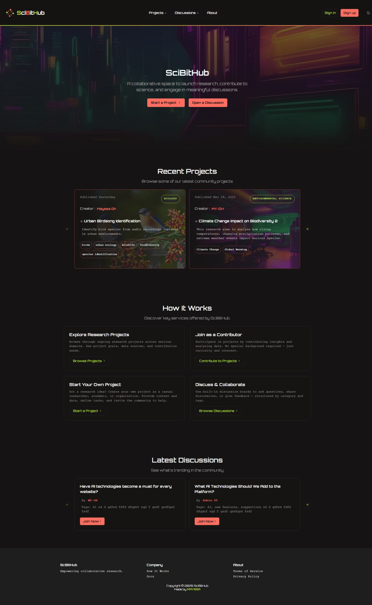
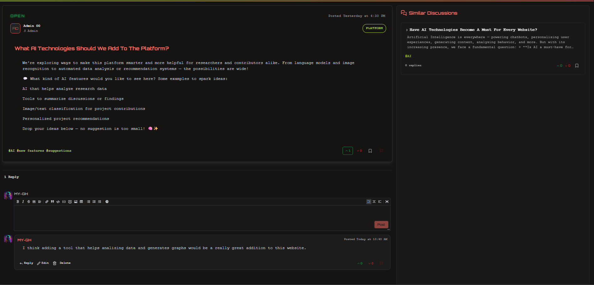

# SciBitHub

**SciBitHub** is a collaborative web platform for launching, contributing to, and discussing citizen science projects.  
It connects researchers, contributors, and curious minds to engage in data collection, annotation tasks, and open scientific discussions.

---

## 🌍 Features

- 🧪 Create and manage research projects
- 🔉 Contribute to tasks by submitting annotations or files
- ✅ Validate task contributions
- 💬 Participate in open discussions, debates & dedicated project forums
- 👍 Upvote/downvote content and like projects
- 📈 Visualize project results with graphs and statistics
- 👤 Role-based access: visitors, contributors, researchers, admins
- 🔒 Content moderation and reporting system
- 📚 Bookmark projects and discussions for quick access
- 📊 Admin dashboard for monitoring platform activity
- 📥 Download collected data for research projects

---

## 🚀 Tech Stack

- **Frontend & Backend**: [Next.js 15 (App Router)](https://nextjs.org/)
- **Database & Auth**: [Supabase](https://supabase.com/)
- **Storage**:
  - Profile/Project images → Supabase Storage
  - Datasets & file uploads (audio/images) → Local [MinIO](https://min.io/)
- **Styling**: Tailwind CSS + ShadCN UI
- **Realtime**: Supabase Realtime
- **Visualization**: Recharts
- **Tables**: [TanStack Table](https://tanstack.com/table)
- **Icons**: Lucide
- **Markdown support**: `@uiw/react-md-editor`

---

## 📸 Screenshots

#### Project overview

#### Task page (data labelling task)

#### Discussion page

---

## 🤝 Open Source Contribution

SciBitHub is now **live and open source**!  
You can access the deployed version here: [https://sci-bit-hub.vercel.app](https://sci-bit-hub.vercel.app)  

If you're interested in contributing, feel free to **fork, star, or open issues/PRs**.

🛠️ **Areas where help is especially welcome**:
- 📊 Data visualization and analytics features  
- 🎨 UI/UX improvements and accessibility  
- 🌍 Internationalization (i18n support)  
- ⚡ Performance and scalability optimization  
- ☁️ File storage and infrastructure (Supabase, MinIO)  
- 📚 Documentation & onboarding improvements  

---

## 🙋 Help Wanted: Hosting & Infrastructure

Although SciBitHub is deployed using free-tier services (Vercel, Supabase), some features like **Google Authentication** and **file uploads** are limited or disabled due to resource constraints.

If you’d like to help with:
- 🚀 Hosting the platform or offering scalable infrastructure  
- 🗃️ Providing cloud storage or file handling (MinIO, S3, etc.)  
- 🤖 Improving deployment, CI/CD, or DevOps  
- 💸 Sponsoring deployment or storage costs  

Please consider [opening an issue](https://github.com/MAY55A/SciBitHub/issues) or contacting me directly.

Every bit of help moves open science forward 🌍✨

## 📄 License

SciBitHub is open-source software licensed under the [GNU Affero General Public License v3.0](https://www.gnu.org/licenses/agpl-3.0.html).

## ✨ About the Developer

Developed by [MAY55A](https://may55a.github.io/Social-links-profile/), as part of an academic project, with a focus on open science, community participation, and technical learning.

📫 **Contact:** [mayssagnm@gmail.com](mailto:mayssagnm@gmail.com)
