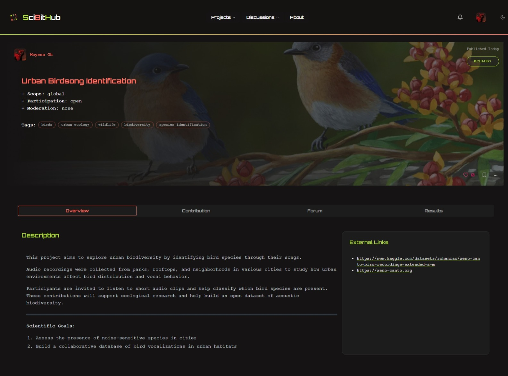

# SciBitHub

**SciBitHub** is a collaborative web platform for launching, contributing to, and discussing citizen science projects.  
It connects researchers, contributors, and curious minds to engage in data collection, annotation tasks, and open scientific discussions.

---

## 🌍 Features

- 🧪 Create and manage research projects
- 🔉 Contribute to tasks by submitting annotations or files
- ✅ Validate task contributions
- 💬 Participate in open discussions, debates & dedicated project forums
- 👍 Upvote/downvote content and like projects
- 📈 Visualize project results with graphs and statistics
- 👤 Role-based access: visitors, contributors, researchers, admins
- 🔒 Content moderation and reporting system
- 📚 Bookmark projects and discussions for quick access
- 📊 Admin dashboard for monitoring platform activity
- 📥 Download collected data for research projects

---

## 🚀 Tech Stack

- **Frontend & Backend**: [Next.js 15 (App Router)](https://nextjs.org/)
- **Database & Auth**: [Supabase](https://supabase.com/)
- **Storage**:
  - Profile/Project images → Supabase Storage
  - Datasets & file uploads (audio/images) → Local [MinIO](https://min.io/)
- **Styling**: Tailwind CSS + ShadCN UI
- **Realtime**: Supabase Realtime
- **Visualization**: Recharts
- **Tables**: [TanStack Table](https://tanstack.com/table)
- **Icons**: Lucide
- **Markdown support**: `@uiw/react-md-editor`

---

## 📸 Screenshots

#### Project overview

#### Task page (data labelling task)

#### Discussion page

---

## 🤝 Open Source Contribution

This project will be made open source after initial stabilization.  
If you're interested in contributing, feel free to star or watch the repository and check back soon!

Planned areas for contribution:

- Data visualization and analytics features  
- UI/UX improvements and accessibility  
- Internationalization (i18n support)  
- Mobile-friendly design and responsive layout  
- Moderation and admin tooling  
- Performance and scalability optimizations  
- File storage and infrastructure support (Supabase, MinIO)  
- Documentation and project onboarding

---

## 🙋 Help Needed: Hosting & Deployment

Due to the platform's data-heavy nature (file uploads, contributions, datasets), it may exceed the limits of free-tier hosting services.

If you're interested in helping with:
- Hosting the platform publicly
- Providing cloud storage or infrastructure
- Sponsoring a deployment or helping with DevOps setup

Feel free to [open an issue](https://github.com/MAY55A/SciBitHub/issues) or contact me directly!

Every contribution helps make open science more accessible.

---

## ✨ About the Developer

Developed by [MAY55A](https://may55a.github.io/Social-links-profile/), as part of an academic engineering project, with a focus on open science, community participation, and technical learning.

📫 **Contact:** [mayssagnm@gmail.com](mailto:mayssagnm@gmail.com)